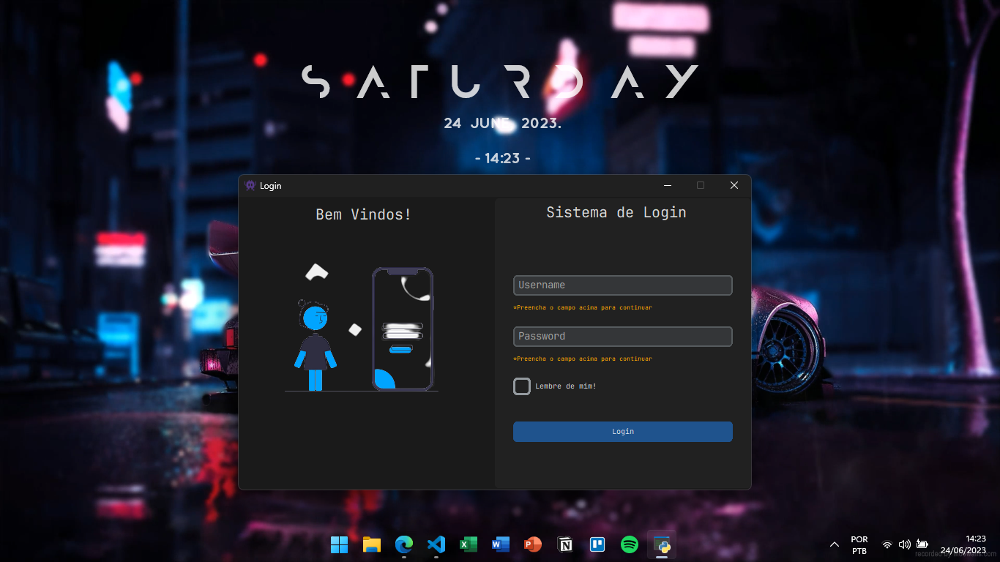

# Projeto de Sistema de Login em Python

Este projeto consiste em criar um sistema de login em Python utilizando a biblioteca Tkinter.

## Descrição do Projeto

O sistema de login deve conter os seguintes elementos:

* Um campo para o usuário digitar seu nome de usuário ou e-mail
* Um campo para o usuário digitar sua senha
* Um botão para o usuário fazer login
* Um link para o usuário recuperar sua senha em caso de esquecimento



Ao clicar no botão de login, o programa deve verificar se o nome de usuário ou e-mail e a senha estão corretos. Se estiverem corretos, o programa deve permitir o acesso do usuário a uma área restrita do sistema. Caso contrário, o programa deve exibir uma mensagem de erro e pedir que o usuário tente novamente.

## Pré-requisitos

- Python 3 instalado no sistema.

## Como Executar o Projeto

1. Clone o repositório para o seu ambiente local:

   ```
   git clone https://github.com/seu-usuario/projeto-sistema-login.git
   ```

2. Acesse o diretório do projeto:

   ```
   cd projeto-sistema-login
   ```

3. Execute o programa:

   ```
   python main.py
   ```

## Contribuindo

Contribuições são bem-vindas! Sinta-se à vontade para abrir um "issue" ou enviar um "pull request".

## Licença

Este projeto está licenciado sob a Licença MIT - veja o arquivo [LICENSE](LICENSE) para mais detalhes.